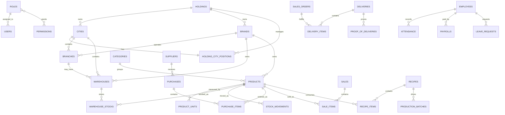

# Database Architecture and ERD

## 1. Database principles

- One PostgreSQL database
- Modular migrations, grouped by domain
- Ledger-style inventory movements
- Financial records designed for later accounting journal expansion
- Every operational table carries the canonical scope quartet:
  `brand_id`, `city_id`, `branch_id`, `warehouse_id`
- Prefer append-only records for stock and financial facts
- Use soft deletes only where business recovery requires it; not for immutable ledgers

## 2. Migration layout

```text
Modules/Holding/Database/Migrations
Modules/Audit/Database/Migrations
Modules/Inventory/Database/Migrations
Modules/Purchasing/Database/Migrations
Modules/Distribution/Database/Migrations
Modules/Delivery/Database/Migrations
Modules/Finance/Database/Migrations
Modules/Tax/Database/Migrations
Modules/POS/Database/Migrations
Modules/Vinz/Database/Migrations
Modules/SateMerah/Database/Migrations
Modules/Shalimar/Database/Migrations
Modules/HRD/Database/Migrations
Modules/Legal/Database/Migrations
Modules/Notifications/Database/Migrations
```

## 3. Core entity groups

| Group | Tables |
| --- | --- |
| Core | `users`, `roles`, `permissions`, `permission_role`, `activity_logs`, `login_logs`, `enterprise_notifications` |
| Hierarchy | `holdings`, `holding_city_positions`, `brands`, `cities`, `branches`, `warehouses` |
| Inventory | `products`, `categories`, `product_units`, `warehouse_stocks`, `stock_movements`, `stock_adjustments`, `stock_opnames`, `stock_transfers` |
| Purchasing | `suppliers`, `purchases`, `purchase_items`, `purchase_payments` |
| Distribution | `sales_orders`, `sales_order_items`, `transfer_requests`, `deliveries`, `delivery_items`, `proof_of_deliveries` |
| POS | `sales`, `sale_items`, `cashier_sessions`, `kitchen_orders` |
| Finance | `payments`, `receivables`, `payables`, `taxes`, `cashflows` |
| Production | `recipes`, `recipe_items`, `production_batches`, `finished_goods`, `production_waste` |
| HRD | `employees`, `attendance`, `payrolls`, `shifts`, `leave_requests` |
| Legal | `contracts`, `legal_documents`, `expiry_reminders` |

## 4. High-level ERD



## 5. Indexing strategy

Minimum indexes for high-volume tables:

- `warehouse_stocks (warehouse_id, product_id)`
- `stock_movements (warehouse_id, product_id, created_at)`
- `stock_movements (brand_id, city_id, branch_id, warehouse_id, created_at)`
- `sales (branch_id, created_at)`
- `sale_items (sale_id, product_id)`
- `purchases (supplier_id, status, created_at)`
- `deliveries (status, scheduled_at)`
- `payments (paymentable_type, paymentable_id)`
- `activity_logs (subject_type, subject_id)`

## 6. Data integrity rules

1. Stock on hand is never edited directly without a movement/audit trail.
2. Transfers create paired source/destination movements.
3. Production consumes raw materials and creates finished goods through explicit conversion rows.
4. Financial writes must be idempotent and transaction-wrapped.
5. Cross-scope reads are blocked by default; widened access must be policy-authorized.

