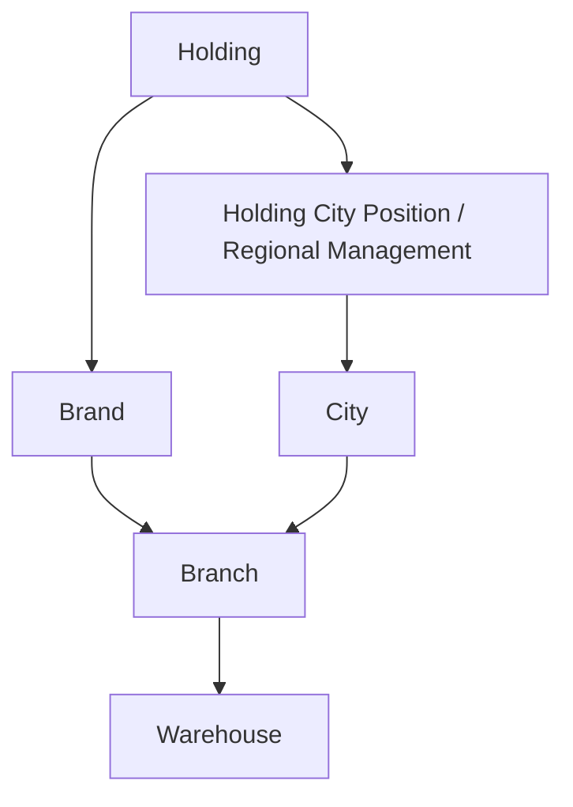
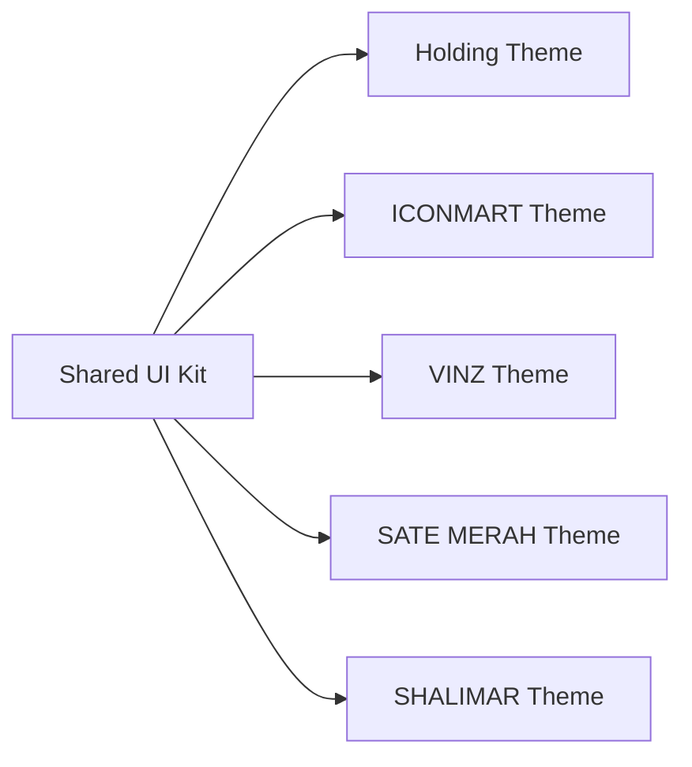

# Holding ERP Ecosystem — Master Architecture

## 1. Product intent

This ERP is a **single Laravel modular monolith** for a centralized holding company that operates:

- retail minimarket and warehouse distribution through **ICONMART**
- fast-food operations through **VINZ**
- QSR production and sales through **SATE MERAH**
- catering and event operations through **SHALIMAR**
- shared holding functions such as finance, tax, HRD, legal, IT, audit, reporting, notifications, and analytics

The application must remain one deployable core while preserving strong domain boundaries.

## 2. Architectural stance

| Concern | Decision |
| --- | --- |
| Application shape | One Laravel core project |
| Architectural style | Modular monolith |
| Data store | One PostgreSQL database |
| UI | Blade shell + Vue islands/components |
| Async work | Redis queues, Horizon in Linux runtime |
| Realtime | Laravel Reverb |
| Auth/API | Laravel session auth + Sanctum-ready API tokens |
| Domain layering | Controllers → Requests → Services → Repositories → Models |
| Isolation | Module service providers, module-local routes/views/migrations |
| Scaling | Stateless web nodes, Redis cache/queue, PostgreSQL indexes, async jobs |

## 3. Enterprise hierarchy



## 4. Scoping model

Every operational transaction carries:

- `brand_id`
- `city_id`
- `branch_id`
- `warehouse_id`

The original brief says every user must also carry those values. In practice, global holding users cannot truthfully belong to one branch or warehouse, so the implementation uses a safer enterprise rule:

- **global roles**: all operational scope fields may be `null`
- **regional roles**: `city_id` required, brand/branch/warehouse may be `null`
- **brand roles**: brand + city required, narrower fields optional by role
- **branch / warehouse roles**: full scope required

The enforcement point is:

1. `ScopeContext`
2. `OperationalScope`
3. role-aware policies
4. request middleware that hydrates scope context from the authenticated user

This avoids impossible data while preserving strict access control.

## 5. Module map

| Module | Primary responsibility |
| --- | --- |
| Holding | hierarchy, region, branch, warehouse ownership |
| Inventory | products, units, stock ledger, reservations |
| Warehouse | receiving, transfers, opnames, stock execution |
| Purchasing | suppliers, purchase orders, approvals, receiving |
| Distribution | internal/external orders and invoicing |
| Delivery | dispatching, POD, assignment, route-ready workflows |
| Finance | invoices, payments, receivables, payables, cashflow |
| Tax | PPN, sales tax, purchase tax, export/consolidation |
| POS | common retail POS primitives |
| Vinz | queue, kitchen, speaker, recipe consumption |
| SateMerah | production conversion, finished goods, waste |
| Shalimar | booking, event orders, planning, delivery scheduling |
| HRD | employees, attendance, payroll, leave |
| Legal | contracts, documents, reminders |
| IT | users, operational monitoring, backups |
| Audit | activity logs, login logs, authorization trail |
| Reports | cross-domain exports and dashboards |
| Notifications | async and realtime notification orchestration |
| Analytics | aggregates, trend analysis, forecasting-ready datasets |

## 6. Project structure

```text
holding-erp/
├── app/
│   ├── Core/
│   │   ├── Models/
│   │   ├── QueryScopes/
│   │   ├── Repositories/
│   │   ├── Services/
│   │   ├── Support/
│   │   └── Traits/
│   └── Providers/
├── Modules/
│   ├── Holding/
│   ├── Inventory/
│   ├── Warehouse/
│   ├── Purchasing/
│   ├── Distribution/
│   ├── Delivery/
│   ├── Finance/
│   ├── Tax/
│   ├── POS/
│   ├── Vinz/
│   ├── SateMerah/
│   ├── Shalimar/
│   ├── HRD/
│   ├── Legal/
│   ├── IT/
│   ├── Audit/
│   ├── Reports/
│   ├── Notifications/
│   └── Analytics/
├── docs/
│   └── architecture/
└── config/modules.php
```

## 7. Dashboard architecture

Use **few big dashboards**, not dozens of brittle role-specific dashboards.

| Dashboard | Typical widgets |
| --- | --- |
| Holding | revenue, city/brand trend, pending approvals, stock critical |
| Regional | city operations, regional warehouse health, branch performance |
| Warehouse & Inventory | on-hand, reserved, movement, expiry, low stock |
| Purchasing | PO aging, supplier performance, receiving SLA |
| Distribution & Delivery | open orders, dispatch status, receivables, POD |
| Finance & Tax | cashflow, payable, receivable, tax liabilities |
| Brand dashboards | role-aware operational widgets per business model |
| HRD / Legal / IT | workforce, documents, platform health |

Menus, widgets, charts, and CTA actions are all permission-driven.

## 8. UI architecture

The supplied HTML references show four distinct visual systems. The ERP should therefore use:

- shared layout primitives
- shared tables/widgets/charts
- per-brand theme tokens
- per-brand POS shells
- one premium public website layer for Shalimar



## 9. Routing architecture

```text
/holding/*
/regional/*
/inventory/*
/warehouse/*
/purchasing/*
/distribution/*
/delivery/*
/finance/*
/tax/*
/pos/iconmart/*
/vinz/*
/satemerah/*
/shalimar/*
/hrd/*
/legal/*
/it/*

/api/v1/holding/*
/api/v1/inventory/*
/api/v1/purchasing/*
...
```

All protected routes eventually compose:

- `auth`
- `verified`
- `scope.context`
- `permission:*`
- policy checks on the target model

## 10. API architecture

- RESTful versioned API under `/api/v1`
- Sanctum tokens for first-party and integration clients
- resource transformers for stable response contracts
- idempotency keys for critical writes such as sales, payments, transfer confirmation
- webhook/event integration reserved for external channels later

## 11. Queue architecture

| Queue | Examples |
| --- | --- |
| `critical` | stock posting, payment posting, financial ledger commands |
| `default` | standard background jobs |
| `notifications` | alerts, reminders, realtime fan-out |
| `reports` | PDF/Excel export, aggregation |
| `integrations` | webhook sync, external service calls |

Realtime events are published after committed transactions, not before.

## 12. Deployment posture

- local Windows/Laragon for coding
- PostgreSQL for shared relational store
- Redis for cache and queue
- Horizon/Reverb hosted in production-grade Linux process runtime
- separate worker processes from web nodes
- object storage for POD uploads and documents
- scheduled tasks for reminders, exports, forecasting snapshots, and cleanup

