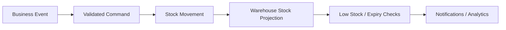
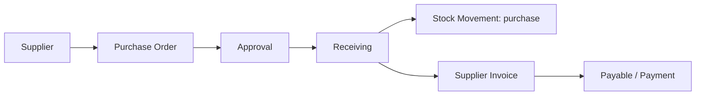
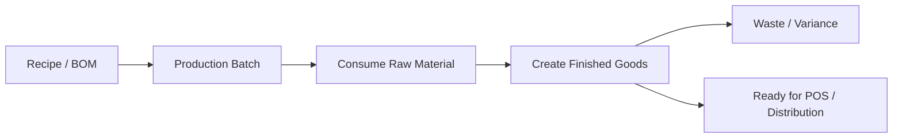
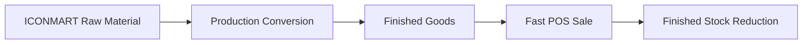

# RBAC and Workflow Architecture

## 1. Role matrix

| Role group | Roles | Default scope |
| --- | --- | --- |
| Global holding | Owner, Global Director, Global Finance, Global IT, Global Legal, Global HRD, Global Audit | holding |
| Regional holding | Regional Manager, Regional Finance, Regional Warehouse, Regional Operational | city |
| Operational | Brand Admin, Warehouse Staff, Purchasing, Distribution Admin, Delivery Coordinator, Driver, Sales Distribution, Cashier, Kitchen, Production Staff, Outlet Supervisor | brand / branch / warehouse |

## 2. Permission matrix skeleton

| Module | View | Create | Update | Approve | Void | Export |
| --- | --- | --- | --- | --- | --- | --- |
| Holding | global/regional | global | global | global | - | global |
| Inventory | scoped | scoped | scoped | approval by rule | - | scoped |
| Purchasing | scoped | scoped | scoped | manager/finance | - | scoped |
| Distribution | scoped | scoped | scoped | manager | - | scoped |
| Delivery | scoped | scoped | scoped | coordinator | - | scoped |
| Finance | scoped/global | scoped | scoped | finance | finance | scoped/global |
| Tax | scoped/global | - | scoped | finance | - | scoped/global |
| POS | scoped | cashier | cashier supervisor | supervisor | supervisor | scoped |
| HRD | role-based | hr/admin | hr/admin | manager | - | hr/global |
| Legal | role-based | legal | legal | legal/global | - | legal/global |

Permission codes follow:

```text
approval.inbox.view
notifications.view
audit.log.view
inventory.stock.view
inventory.adjustment.create
inventory.adjustment.approve
purchasing.supplier.view
purchasing.supplier.create
purchasing.supplier.update
purchasing.supplier.deactivate
purchasing.purchase.create
purchasing.purchase.view
purchasing.purchase.approve
purchasing.purchase.receive
pos.sale.void
finance.payment.approve
tax.report.export
```

## 3. Inventory flow



## 4. Purchasing flow



## 5. Production flow



## 6. Distribution and delivery flow


## 7. Finance and tax flow


## 8. Brand-specific flows

### VINZ


### SATE MERAH



### SHALIMAR


## 9. Notification architecture

| Trigger | Recipient |
| --- | --- |
| Low stock | warehouse, regional warehouse, purchasing |
| Pending approval | approvers by permission |
| Delivery event | coordinator, branch, customer-facing role |
| Finance due date | finance |
| Tax deadline | tax / finance |
| Contract expiry | legal / HRD |
| Attendance anomaly | HRD / supervisor |

Notifications are fan-out jobs, not synchronous controller work.


